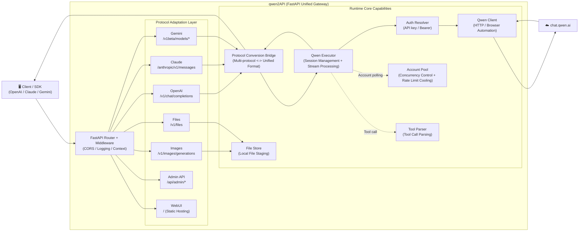

# qwen2API Enterprise Gateway

[](https://github.com/YuJunZhiXue/qwen2API/blob/main/LICENSE)
[](https://github.com/YuJunZhiXue/qwen2API/stargazers)
[](https://github.com/YuJunZhiXue/qwen2API/network/members)
[](https://github.com/YuJunZhiXue/qwen2API/releases)
[](https://hub.docker.com/r/yujunzhixue/qwen2api)

[](https://zeabur.com/templates/qwen2api)
[](https://vercel.com/new/clone?repository-url=https%3A%2F%2Fgithub.com%2FYuJunZhiXue%2Fqwen2API)

Language / Languages: [English](./README.md) | [Chinese](./README.cn.md)

qwen2API is used to convert Qwen (chat.qwen.ai) web version capabilities into OpenAI, Anthropic Claude, and Gemini compatible interfaces. The project backend is based on FastAPI, the frontend is based on React + Vite, with a built-in admin panel, account pool, tool call parsing, image generation pipeline, and multiple deployment methods.

---

## Table of Contents

- [Project Description](#project-description)
- [Architecture Overview](#architecture-overview)
- [Core Capabilities](#core-capabilities)
- [Supported Interfaces](#supported-interfaces)
- [Model Mapping](#model-mapping)
- [Image Generation](#image-generation)
- [Quick Start](#quick-start)
  - [Method 1: Run Pre-built Docker Image Directly (Recommended)](#method-1-run-pre-built-docker-image-directly-recommended)
  - [Method 2: Run from Local Source Code](#method-2-run-from-local-source-code)
- [Environment Variables (.env)](#environment-variables-env)
- [docker-compose.yml Explanation](#docker-composeyml-explanation)
- [Port Explanation](#port-explanation)
- [WebUI Admin Panel](#webui-admin-panel)
- [Data Persistence](#data-persistence)
- [Project Directory Structure](#project-directory-structure)
- [Advanced Features & Internal Mechanisms](#advanced-features--internal-mechanisms)
- [Performance Optimization & Stability](#performance-optimization--stability)
- [Client Integration Examples](#client-integration-examples)
- [FAQ](#faq)
- [Troubleshooting Quick Reference](#troubleshooting-quick-reference)
- [Development Guide](#development-guide)
- [Changelog & Roadmap](#changelog--roadmap)
- [License & Disclaimer](#license--disclaimer)

---

## Project Description

This project provides the following capabilities:

1. Converts Qwen web chat capabilities into the OpenAI Chat Completions interface.
2. Converts Qwen web chat capabilities into the Anthropic Messages interface.
3. Converts Qwen web chat capabilities into the Gemini GenerateContent interface.
4. Provides an independent image generation interface `POST /v1/images/generations`.
5. Supports Tool Calling and tool result returns.
6. Provides an admin panel for account management, API Key management, image generation testing, and runtime status viewing.
7. Provides multi-account polling, rate-limit cooling, retry, and browser/httpx hybrid engine.

---

## Architecture Overview



**Architecture Description**:

- **Backend**: Python FastAPI (`backend/`), uniformly handles multi-protocol adaptation and upstream calls
- **Frontend**: React Admin Panel (`frontend/`), hosts static build artifacts at runtime
- **Deployment**: Docker (recommended), local run, Vercel, Zeabur

**Core Features**:

- **Unified Routing Core**: All protocol entries converge to the FastAPI Router, avoiding behavioral drift from multiple entry points
- **Protocol Conversion Bridge**: Claude / Gemini entries are first converted to a unified format, then call upstream, and finally converted back to the original protocol response
- **Tool Call Support**: Supports OpenAI / Claude / Gemini tool call formats, with automatic parsing and conversion
- **Account Pool Management**: Multi-account polling, concurrency control, rate limit cooling, automatic retry
- **File Attachments**: Supports file upload, local staging, and context injection
- **Image Generation**: Independent image generation interface, supporting multiple aspect ratios

---

## Core Capabilities

- OpenAI / Anthropic / Gemini triple interface compatibility.
- Tool call parsing and tool result returns.
- Browser Engine, Httpx Engine, Hybrid Engine: three execution modes.
- Multi-account concurrency pool, dynamic cooling, fault retry.
- Image generation based on Qwen web's real tool chain.
- WebUI Admin Panel.
- Health check and readiness check interfaces.
- **Chat ID Warm-up Pool**: Background pre-built session queue, saving 500ms~3s handshake time per request.
- **Schema Compression**: JSON Schema → TypeScript-like signatures, saving ~90% space in tool prompts.
- **Tool Name Obfuscation**: Client tool names automatically get a `u_` prefix or alias to avoid Qwen's built-in function validation interception.
- **Tool Call Hallucination Protection**: auto_agent_blocked, repeated call interception, empty response retry, toxic refusal identification.
- **Truncation Auto-Continuation**: Automatically continues and deduplicates concatenation when `##TOOL_CALL##` is unclosed.
- **File Content Caching**: Caches the real content of Claude Code's "Unchanged since last read" on the proxy side.
- **Historical Refusal Cleaning**: Scans historical assistant messages for refusal/self-limiting text to prevent cascading recurrence.
- **Incremental Stream Warmup**: Accumulates 96 characters before emitting, filtering out apology prefixes and incomplete tool calls during this period.
- **Topic Isolation**: Detects entity Jaccard similarity of user messages, automatically discarding irrelevant history when a new task is determined.
- **Tool Few-Shot Injection**: Selects representative tools by namespace to construct synthetic few-shots, improving hit rates for MCP / Skill tools.
- **Edit/StrReplace Fuzzy Matching**: Automatically fixes exact match failures caused by smart quotes, whitespace, and backslash differences.
- **CLIProxy Protocol Conversion Layer**: Multi-protocol entries uniformly fall to `StandardRequest`, avoiding behavioral drift from multiple entries.

---

## Supported Interfaces

| Interface Type | Path | Description |
|---|---|---|
| OpenAI Chat | `POST /v1/chat/completions` | Supports streaming & non-streaming, tool calls, automatic image intent recognition |
| OpenAI Models | `GET /v1/models` | Returns available model aliases |
| OpenAI Images | `POST /v1/images/generations` | Image generation interface |
| Anthropic Messages | `POST /anthropic/v1/messages` | Claude / Anthropic SDK compatible |
| Gemini GenerateContent | `POST /v1beta/models/{model}:generateContent` | Gemini SDK compatible |
| Gemini Stream | `POST /v1beta/models/{model}:streamGenerateContent` | Streaming output |
| Admin API | `/api/admin/*` | Admin interface |
| Health | `/healthz` | Liveness probe |
| Ready | `/readyz` | Readiness probe |

---

## Model Mapping

Currently, mainstream client model names are mapped uniformly to `qwen3.6-plus` by default.

| Input Model Name | Actual Call |
|---|---|
| `gpt-4o` / `gpt-4-turbo` / `gpt-4.1` / `o1` / `o3` | `qwen3.6-plus` |
| `gpt-4o-mini` / `gpt-3.5-turbo` | `qwen3.6-plus` |
| `claude-opus-4-6` / `claude-sonnet-4-6` / `claude-3-5-sonnet` | `qwen3.6-plus` |
| `claude-3-haiku` / `claude-haiku-4-5` | `qwen3.6-plus` |
| `gemini-2.5-pro` / `gemini-2.5-flash` / `gemini-1.5-pro` | `qwen3.6-plus` |
| `deepseek-chat` / `deepseek-reasoner` | `qwen3.6-plus` |

When not hitting the mapping table, it defaults to the input model name itself; if custom mapping rules are set in the admin panel, the configuration prevails.

---

## Image Generation

qwen2API provides image generation capabilities compatible with the OpenAI Images interface.

- Interface: `POST /v1/images/generations`
- Default model alias: `dall-e-3`
- Actual underlying: `qwen3.6-plus` + Qwen web `image_gen` tool
- Returned image link domain: usually `cdn.qwenlm.ai`

### Request Example

```bash
curl http://127.0.0.1:7860/v1/images/generations \
  -H "Content-Type: application/json" \
  -H "Authorization: Bearer YOUR_API_KEY" \
  -d '{
    "model": "dall-e-3",
    "prompt": "A cyberpunk-style cat, neon light background, hyper-realistic",
    "n": 1,
    "size": "1024x1024",
    "response_format": "url"
  }'
```

### Response Example

```json
{
  "created": 1712345678,
  "data": [
    {
      "url": "https://cdn.qwenlm.ai/output/.../image.png?key=...",
      "revised_prompt": "A cyberpunk-style cat, neon light background, hyper-realistic"
    }
  ]
}
```

### Supported Image Aspect Ratios

The frontend image generation page includes the following ratios:

- `1:1`
- `16:9`
- `9:16`
- `4:3`
- `3:4`

### Chat Interface Image Intent Recognition

`/v1/chat/completions` supports automatic recognition of image generation intent based on user messages. For example:

- "Help me draw a..."
- "Generate an image of..."
- "draw an image of ……"

When recognized as an image generation request, the system automatically switches to the image generation pipeline.

---

## Quick Start

### Method 1: Run Pre-built Docker Image Directly (Recommended)

This method is suitable for production environments, test servers, and general deployment scenarios.  
The advantages are: **No need to compile the frontend locally, no need to build the image on the server, no need for the server to download Camoufox itself.**

#### Step 1: Prepare Directory

```bash
mkdir qwen2api && cd qwen2api
mkdir -p data logs
```

#### Step 2: Create `docker-compose.yml`

```yaml
services:
  qwen2api:
    image: ruh00/qwen2API:latest
    container_name: qwen2api
    restart: unless-stopped
    env_file:
      - path: .env
        required: false
    ports:
      - "7860:7860"
    volumes:
      - ./data:/workspace/data
      - ./logs:/workspace/logs
    shm_size: '256m'
    environment:
      PYTHONIOENCODING: utf-8
      PORT: "7860"
      ENGINE_MODE: "hybrid"
    healthcheck:
      test: ["CMD", "curl", "-f", "http://localhost:7860/healthz"]
      interval: 30s
      timeout: 10s
      start_period: 120s
      retries: 3
```

#### Step 3: Create `.env` (Optional but Recommended)

It is recommended to include at least the following:

```env
# ========== MUST MODIFY ==========
ADMIN_KEY=change-me-now              # Admin panel login key, MUST be changed to a strong password!

# ========== BASIC CONFIGURATION ==========
PORT=7860                            # Service listening port
WORKERS=1                            # Number of Uvicorn workers, MUST remain 1 (multiple workers will cause JSON file conflicts)
LOG_LEVEL=INFO                       # Log level: DEBUG/INFO/WARNING/ERROR

# ========== CONCURRENCY CONTROL ==========
MAX_INFLIGHT=1                       # Max concurrent requests per account (can be changed to 2 when having many accounts)
MAX_RETRIES=3                        # Max retries for failed requests (increase to 5 when network is unstable)

# ========== RATE LIMIT COOLING ==========
ACCOUNT_MIN_INTERVAL_MS=1200         # Minimum interval between two requests for the same account (milliseconds), enabled when rate-limited
REQUEST_JITTER_MIN_MS=120            # Minimum random jitter before request (milliseconds)
REQUEST_JITTER_MAX_MS=360            # Maximum random jitter before request (milliseconds)
RATE_LIMIT_BASE_COOLDOWN=600         # Base cooldown time for rate limiting (seconds), increase to 1200 when frequently rate-limited
RATE_LIMIT_MAX_COOLDOWN=3600         # Maximum cooldown time for rate limiting (seconds)

# ========== DATA FILE PATHS (Usually no need to change for Docker deployment) ==========
ACCOUNTS_FILE=/workspace/data/accounts.json
USERS_FILE=/workspace/data/users.json
CONTEXT_CACHE_FILE=/workspace/data/context_cache.json
UPLOADED_FILES_FILE=/workspace/data/uploaded_files.json
```

**Detailed Environment Variables Explanation**:

| Variable | Default | Description | When to Modify |
|------|--------|------|----------|
| `ADMIN_KEY` | `admin` | Admin panel login key | **Must change** to a strong password |
| `PORT` | `7860` | Service listening port | Modify when port conflicts occur |
| `WORKERS` | `1` | Number of Uvicorn workers | **Must remain 1**, multiple workers will cause data conflicts |
| `LOG_LEVEL` | `INFO` | Log level | Change to `DEBUG` for debugging, `WARNING` for production |
| `MAX_INFLIGHT` | `1` | Max concurrent requests per account | Can be changed to `2` when accounts are numerous and stable |
| `MAX_RETRIES` | `3` | Max retries for failed requests | Increase to `5` when network is unstable |
| `ACCOUNT_MIN_INTERVAL_MS` | `0` | Minimum interval between requests for the same account (ms) | Change to `1200` when rate-limited |
| `REQUEST_JITTER_MIN_MS` | `0` | Minimum request jitter | Set to `120` to simulate real user behavior |
| `REQUEST_JITTER_MAX_MS` | `0` | Maximum request jitter | Set to `360` to simulate real user behavior |
| `RATE_LIMIT_BASE_COOLDOWN` | `600` | Rate limit cooldown time (seconds) | Increase to `1200` when frequently rate-limited |

**docker-compose.yml Configuration Explanation**:

| Configuration Item | Description | Suggested Modifications |
|--------|------|----------|
| `image` | Pre-built image address, supports amd64/arm64 | Keep default `ruh00/qwen2API:latest` |
| `ports` | Port mapping, format: `Host Port:Container Port` | If 7860 is occupied, change to `"8080:7860"` |
| `volumes` | Data persistence mount | **Must keep**, otherwise data will be lost after restart |
| `shm_size` | Browser shared memory | Change to `"512m"` if browser crashes |
| `environment.PORT` | Service port inside container | Usually no need to change |
| `healthcheck` | Health check configuration | Keep default |

#### Step 4: Start Service

```bash
docker compose up -d
```

#### Step 5: Check Status

```bash
docker compose ps
docker compose logs -f
curl http://127.0.0.1:7860/healthz
```

#### Step 6: Update Service

```bash
docker compose pull
docker compose up -d
```

---

### Method 2: Run from Local Source Code

This method is suitable for local development and debugging.

#### Environment Requirements

- Python 3.12+
- Node.js 20+
- Accessible Camoufox download source

#### Steps

```bash
git clone https://github.com/ruh00/qwen2API.git
cd qwen2API
python start.py
```

`python start.py` will automatically complete the following tasks:

1. Install backend dependencies
2. Download Camoufox browser kernel
3. Install frontend dependencies
4. Build frontend
5. Start backend service

---

## Environment Variables (.env)

The project provides `.env.example` as a template. Below are the main parameter explanations.

### Basic Parameters

| Parameter | Default | Description |
|---|---|---|
| `ADMIN_KEY` | `change-me-now` / `admin` | Admin panel admin key. It is recommended to change it immediately after deployment. |
| `PORT` | `7860` | Backend service listening port. |
| `WORKERS` | `1` or `3` | Number of Uvicorn workers. Recommended 1 for single-instance environments. |
| `REGISTER_SECRET` | Empty | User registration key. Empty means no restriction on registration. |

### Engine Parameters

| Parameter | Default | Description |
|---|---|---|
| `ENGINE_MODE` | `hybrid` | Engine mode. Options: `hybrid`, `httpx`, `browser`. |
| `BROWSER_POOL_SIZE` | `2` | Browser page pool size. Larger value means higher concurrency, but also higher memory usage. |
| `STREAM_KEEPALIVE_INTERVAL` | `5` | Streaming output keepalive interval. |

#### `ENGINE_MODE` Explanation

- `hybrid`: Recommended mode. Chatting, creating sessions, deleting sessions prioritize the browser; httpx acts as a fault fallback.
- `httpx`: All prioritize httpx / curl_cffi. Faster, but weaker browser characteristics, suitable for speed-priority testing scenarios.
- `browser`: All go through the browser. Closer to a real web environment, but higher resource usage.

If you need to switch between `httpx` and `hybrid`, just modify:

```env
ENGINE_MODE=httpx
```

Or:

```env
ENGINE_MODE=hybrid
```

After modification, restart the service:

```bash
docker compose restart
```

### Concurrency and Risk Control Parameters

| Parameter | Default | Description |
|---|---|---|
| `MAX_INFLIGHT` | `1` | Max concurrent requests allowed per account. |
| `ACCOUNT_MIN_INTERVAL_MS` | `1200` | Minimum interval between two requests for the same account. |
| `REQUEST_JITTER_MIN_MS` | `120` | Minimum random jitter. |
| `REQUEST_JITTER_MAX_MS` | `360` | Maximum random jitter. |
| `MAX_RETRIES` | `2` | Max retries for failed requests. |
| `TOOL_MAX_RETRIES` | `2` | Max retries for tool call related issues. |
| `EMPTY_RESPONSE_RETRIES` | `1` | Max retries for empty responses. |
| `RATE_LIMIT_BASE_COOLDOWN` | `600` | Base cooldown time for account rate limiting (seconds). |
| `RATE_LIMIT_MAX_COOLDOWN` | `3600` | Maximum cooldown time for account rate limiting (seconds). |

### Data Path Parameters

| Parameter | Default | Description |
|---|---|---|
| `ACCOUNTS_FILE` | `/workspace/data/accounts.json` | Account data file path. |
| `USERS_FILE` | `/workspace/data/users.json` | API Key / user data file path. |
| `CAPTURES_FILE` | `/workspace/data/captures.json` | Capture results file path. |
| `CONFIG_FILE` | `/workspace/data/config.json` | Runtime configuration file path. |

---

## docker-compose.yml Explanation

The following is the recommended Compose configuration:

```yaml
services:
  qwen2api:
    image: ruh00/qwen2API:latest
    container_name: qwen2api
    restart: unless-stopped
    env_file:
      - path: .env
        required: false
    ports:
      - "7860:7860"
    volumes:
      - ./data:/workspace/data
      - ./logs:/workspace/logs
    shm_size: '256m'
    environment:
      PYTHONIOENCODING: utf-8
      PORT: "7860"
      ENGINE_MODE: "hybrid"
    healthcheck:
      test: ["CMD", "curl", "-f", "http://localhost:7860/healthz"]
      interval: 30s
      timeout: 10s
      start_period: 120s
      retries: 3
```

### Field Explanation

| Field | Description |
|---|---|
| `image` | Pre-built image address. Recommended for general deployment. |
| `container_name` | Container name. |
| `restart` | Automatically restart on boot or failure. |
| `env_file` | Load environment variables from `.env`. |
| `ports` | Map host port to container port. |
| `volumes` | Persistent data and logs directories. |
| `shm_size` | Browser shared memory. At least 256m recommended for Camoufox / Firefox. |
| `environment` | Environment variables written directly in Compose, higher priority than image defaults. |
| `healthcheck` | Container health check. |

### Parts Users Need to Modify

Usually, you only need to modify the following based on your deployment environment:

1. **Port Mapping**
   ```yaml
   ports:
     - "7860:7860"
   ```
   If server port 7860 is occupied, you can change it to:
   ```yaml
   ports:
     - "8080:7860"
   ```

2. **Engine Mode**
   ```yaml
   environment:
     ENGINE_MODE: "hybrid"
   ```
   Can be changed to:
   ```yaml
   environment:
     ENGINE_MODE: "httpx"
   ```

3. **Shared Memory**
   ```yaml
   shm_size: '256m'
   ```
   If the browser crashes easily, you can change it to:
   ```yaml
   shm_size: '512m'
   ```

4. **Data Mount Directory**
   ```yaml
   volumes:
     - ./data:/workspace/data
     - ./logs:/workspace/logs
   ```
   If you need to customize the storage path, replace the left host directory.

---

## Port Explanation

### Why are the frontend and backend on the same port in Docker deployment

The frontend static files are already built in the Docker image and uniformly hosted by the backend:

- Backend API: `http://host:7860/*`
- Frontend Admin Panel: `http://host:7860/`

Therefore, **Docker deployment defaults to only one port, 7860**.

### Why might it not be the same port during local development

Local development usually has two methods:

1. **Using `python start.py`**  
   The frontend will first be built into static files, then uniformly hosted by the backend. At this time, it is usually still one port.

2. **Running the frontend Vite dev server separately**  
   For example:
   - Frontend: `http://localhost:5173`
   - Backend: `http://localhost:7860`

This mode is only used for frontend development debugging and is not a production deployment mode.

---

## WebUI Admin Panel

The admin panel is hosted by the backend by default, accessible at:

```text
http://127.0.0.1:7860/
```

Main pages include:

| Page | Description |
|---|---|
| Runtime Status | View overall service status, engine status, and statistics |
| Account Management | Add, test, disable, view upstream account status |
| API Key | Manage downstream call keys |
| Interface Testing | Directly test OpenAI chat interface |
| Image Generation | Graphical image generation page |
| System Settings | View and modify some runtime parameters |

---

## Data Persistence

Default data directories:

- `data/accounts.json`: Upstream account information
- `data/users.json`: Downstream API Key / user data
- `data/captures.json`: Capture results
- `data/config.json`: Runtime configuration
- `logs/`: Runtime logs

In production environments, be sure to persist `data/` and `logs/`.

---

## Project Directory Structure

```text
qwen2API/
├── backend/                        # Python FastAPI Backend
│   ├── main.py                     # Application entry, register routes / middleware / lifespan
│   ├── api/                        # Protocol Entry Layer
│   │   ├── chat.py                 # OpenAI Chat Completions
│   │   ├── anthropic.py            # Anthropic Messages
│   │   ├── gemini.py               # Gemini GenerateContent
│   │   ├── images.py               # Image Generation
│   │   ├── files.py                # File Upload / Management
│   │   ├── admin.py                # Admin API
│   │   └── models.py               # Model Aliases
│   ├── adapter/
│   │   ├── cli_proxy.py            # Multi-protocol → StandardRequest conversion proxy
│   │   └── standard_request.py     # Unified request structure + client profile
│   ├── core/
│   │   ├── config.py               # Global configuration / model mapping
│   │   ├── request_logging.py      # Request context + chain logging
│   │   ├── auth.py                 # API Key / Bearer authentication
│   │   └── account_pool/           # Account Pool (split into submodules)
│   │       ├── pool_core.py        # Pool status / cooling / elimination
│   │       └── pool_acquire.py     # Account acquisition / concurrency control
│   ├── runtime/
│   │   ├── execution.py            # Stream execution + retry directives
│   │   └── stream_metrics.py       # Stream metrics instrumentation
│   ├── services/                   # Stability / format conversion / compatibility layer
│   │   ├── qwen_client.py          # HTTP + browser dual engine
│   │   ├── prompt_builder.py       # Messages → prompt + tools assembly
│   │   ├── tool_parser.py          # ##TOOL_CALL## text protocol parsing
│   │   ├── tool_validator.py       # Tool input validation
│   │   ├── tool_arg_fixer.py       # Smart quote / fuzzy Edit fix
│   │   ├── tool_few_shot.py        # Inject few-shots by namespace
│   │   ├── tool_name_obfuscation.py# Tool name obfuscation to avoid Qwen function validation
│   │   ├── schema_compressor.py    # JSON Schema → TS-like signature
│   │   ├── chat_id_pool.py         # chat_id warm-up pool
│   │   ├── file_content_cache.py   # Read result cache
│   │   ├── incremental_text_streamer.py # Stream warmup / guard
│   │   ├── refusal_cleaner.py      # Historical refusal text cleaning
│   │   ├── topic_isolation.py      # New task detection / history splitting
│   │   ├── truncation_recovery.py  # ##TOOL_CALL## truncation continuation
│   │   ├── openai_stream_translator.py # Text protocol → OpenAI SSE
│   │   ├── context_attachment_manager.py # Long context → attachments
│   │   ├── context_offload.py      # Context offload strategy
│   │   ├── context_cleanup.py      # TTL cleanup
│   │   ├── auth_resolver.py        # API Key → upstream account
│   │   ├── auth_quota.py           # Downstream Key quota
│   │   ├── completion_bridge.py    # Multi-protocol response bridge
│   │   ├── file_store.py           # Local file staging
│   │   ├── upstream_file_uploader.py # File upload to Qwen
│   │   ├── garbage_collector.py    # Session / temp file GC
│   │   ├── response_formatters.py  # Various protocol response formatting
│   │   ├── standard_request_builder.py
│   │   ├── attachment_preprocessor.py
│   │   ├── task_session.py
│   │   └── token_calc.py
│   ├── toolcall/
│   │   ├── normalize.py            # Tool name normalization
│   │   ├── stream_state.py         # Stream tool call state machine
│   │   └── formats_json.py         # JSON tool format
│   ├── upstream/
│   │   └── qwen_executor.py        # Session lifecycle + stream distribution
│   └── data/                       # Runtime writable directory (accounts/users/config/...)
├── frontend/                       # React + Vite Admin Panel
│   ├── src/
│   │   ├── pages/                  # Dashboard / Settings / Test / Images
│   │   ├── layouts/
│   │   └── components/
│   └── vite.config.ts
├── docker-compose.yml
├── Dockerfile
├── start.py                        # One-click start (install dependencies + download browser + build frontend)
├── requirements.txt
├── .env.example
└── README.md
```

---

## Advanced Features & Internal Mechanisms

The following are internal modules introduced by qwen2API to run stable tool calls on the weakly constrained upstream of "Qwen web chat". Regular users can ignore them; refer to them when aiming for deep customization or code contribution.

### Chat ID Warm-up Pool (`chat_id_pool.py`)

- **Motivation**: `/api/v2/chats/new` handshake takes 500ms when healthy, and can reach 5~6s during jitter.
- **Approach**: After the service starts, pre-build `target_per_account` `chat_id`s for each available account. When a request arrives, directly pop one; once used, the background immediately refills it.
- **TTL**: A single `chat_id` expires in 30 minutes by default; if expired, it is discarded and rebuilt.
- **Fallback**: When a warm-up chat_id cannot be obtained, fallback to synchronous `create_chat`.

### Schema Compression (`schema_compressor.py`)

Compress JSON Schema into TS-like signatures:

```
Input: {"type":"object","properties":{
         "file_path":{"type":"string"},
         "encoding":{"type":"string","enum":["utf-8","base64"]}},
       "required":["file_path"]}

Output: {file_path!: string, encoding?: utf-8|base64}
```

- Single tool definition reduced from ~1.5KB to ~150~250 bytes. 90 tools ~135KB → ~15KB.
- The smaller the input, the more upstream output budget, and the lower the truncation rate.

### Tool Name Obfuscation (`tool_name_obfuscation.py`)

The Qwen upstream treats common short names (Read/Write/Bash/Edit…) as built-in functions for validation and returns "Tool X does not exists.".

- **Explicit Aliases**: `Read→fs_open_file`, `Bash→shell_run`, `Grep→text_search`, etc.
- **General Fallback**: Other client tools automatically get a `u_` prefix, e.g., `TaskCreate→u_TaskCreate`, `mcp__playwright__click→u_mcp__playwright__click`.
- Outbound (sent to Qwen) automatically converts; inbound (Qwen returns) reversely restores to the client.

### Tool Call Few-Shot (`tool_few_shot.py`)

- **Problem**: With 90+ tools (including MCP / Skills / Plugin multi-namespaces), Qwen tends to only call a few "familiar" core tools, and MCP / Skill are almost never proactively used.
- **Approach**: Group by namespace to pick one representative tool, construct a synthetic `[user → assistant]` conversation, where the assistant demonstrates **multiple types of tools being called simultaneously** (1 core + up to 4 third-party representatives).
- **Effect**: The model sees "the assistant used 5 different types of tools in the first step" and will reproduce this diversity.

### Tool Call Truncation Continuation (`truncation_recovery.py`)

- Detection: Number of `##TOOL_CALL##` open tags > Number of `##END_CALL##` close tags → indicates an action block is not yet closed.
- Continuation: Discard all tool definitions and history (to save tokens), keep only the last 2000 bytes as an anchor, inject anchor + user "Please continue from the breakpoint, do not repeat" into the assistant role.
- Deduplication: `deduplicateContinuation` removes overlap with the existing end; continues at most `MAX_AUTO_CONTINUE` times.

### File Content Caching (`file_content_cache.py`)

When the Claude Code client repeatedly Reads the same file, it does not resend the full content, only sending a "File unchanged since last read" prompt. However, qwen2API creates a new Qwen chat for each request, Qwen has no history at all, making the prompt meaningless.

- Retain the most recent real Read result on the proxy side by `(api_key, file_path)`
- Backfill with cache when the prompt is detected
- In-memory LRU, max 200 entries, 15 min TTL per entry, session isolation by API KEY

### Historical Refusal Cleaning (`refusal_cleaner.py`)

Scans past assistant messages for refusal / self-limiting text ("I'm sorry, I cannot help...", "我只能回答编程相关问题", "Tool X does not exist"). On a hit, replaces the entire message content with a placeholder tool call to prevent the model from seeing its own refusal pattern and cascading it.

### Incremental Stream Warmup (`incremental_text_streamer.py`)

- **warmup**: Accumulates 96 characters before starting output. During this period, refusal detection / format judgment can be performed.
- **guard**: Whenever outputting to the client, keeps the last 256 characters temporarily unoutputted, leaving room for cross-chunk detection (e.g., identifying the `##TOOL_CALL##` start tag).
- **finish()**: Appends all remaining characters at the end.

### Topic Isolation (`topic_isolation.py`)

- Extracts **key entities** from each user message: file paths, URLs, proper nouns / quoted strings / camelCase identifiers.
- Calculates the **Jaccard similarity** between the latest user message entity set and the historical first user entity set.
- When the latest user has its own non-empty entity set and Jaccard < 0.1 → determined as a new task → caller discards history.
- Prevents old tool call history from misleading the model when the user switches from "read file" to "browser registration".

### Tool Parameter Fuzzy Fix (`tool_arg_fixer.py`)

- **smart quote replacement**: `" " ' '` → ASCII `" '`.
- **Edit / StrReplace Fuzzy Matching**: When old_string does not exact match, construct a fuzzy regex (tolerating quotes / whitespace / backslashes) to search in the file; if a unique hit is found, replace old_string in args with the real text.

### Account Pool Sub-modularization (`core/account_pool/`)

The original `account_pool.py` has been split into:

- `pool_core.py`: Pool status / cooling / elimination strategy
- `pool_acquire.py`: Concurrency control + account acquisition (MAX_INFLIGHT + MIN_INTERVAL + jitter)

The old file `account_pool_old.py` is kept for reference only and is no longer referenced.

### CLIProxy Protocol Conversion Layer (`adapter/cli_proxy.py`)

Multi-protocol entries (OpenAI / Claude / Gemini) uniformly fall to `StandardRequest` through `CLIProxy.from_openai` / `from_anthropic` / `from_gemini`, avoiding behavioral drift caused by each of the three entries maintaining its own prompt assembly / tool assembly / client_profile determination logic.

### Runtime Retry Directives (`runtime/execution.py`)

Centralized retry decision-making, supporting the following trigger causes:

| Cause | Condition | Processing |
|---|---|---|
| `blocked_tool_name` | Hit a tool name known to be blocked by Qwen validation | Inject format reminder |
| `invalid_textual_tool_contract` | `##TOOL_CALL##` format error | Inject format example |
| `repeated_same_tool` | Same tool + same parameters called repeatedly | Inject repeated call ban |
| `unchanged_read_result` | Just received "Unchanged since last read" and wants to Read the same file again | Force tool switch |
| `auto_agent_blocked` | User did not mention agent but automatically called Agent | Force no Agent call |
| `search_no_results` | Last WebSearch had no results and searching the same term again | Force tool switch |
| `empty_upstream_response` | Upstream returned empty | Switch account + switch chat_id to retry |
| `toxic_refusal_early` | Refusal/hallucination detected early in stream | Early interception + retry |

---

## Performance Optimization & Stability

### Hybrid Streaming Mode

Tool calls use a buffered mode (10~30s waiting for complete parsing), while pure text uses real-time streaming (first token ~5s). This avoids emitting incomplete `##TOOL_CALL##` midway through the stream which leads to client parsing failure, while ensuring fast first-token response in chat scenarios.

### Browser Priority Routing

Production deployment defaults to `ENGINE_MODE=hybrid`:

- **Chat / Create Session / Delete Session**: Prioritize browser (Camoufox), higher mimicry, lower risk of rate limiting.
- **Fault Fallback**: Automatically degrades to httpx / curl_cffi when the browser fails.
- Avoids the risk of account bans associated with a full httpx approach.

### Warm-up and Pooling

| Pool | Role | Savings on Hit |
|---|---|---|
| Account Pool | Multi-account polling | 0 handshakes per request |
| Chat ID Warm-up Pool | Pre-built sessions | 500ms~6s |
| Browser Page Pool | Pre-opened Camoufox pages | Browser cold start 3~10s |

### Rate Limit Cooling Strategy

When an account hits 429 / risk control:

- **Base Cooling**: `RATE_LIMIT_BASE_COOLDOWN` (default 600s)
- **Exponential Backoff**: Doubles when cooling is triggered consecutively, up to `RATE_LIMIT_MAX_COOLDOWN` (default 3600s)
- **Automatic Skip During Cooling**: The pool automatically filters out accounts in cooling when acquiring accounts

### Request Jitter

`REQUEST_JITTER_MIN_MS` / `REQUEST_JITTER_MAX_MS` introduces a random delay before each request, preventing hundreds or thousands of requests from hitting the upstream at the same moment and causing simultaneous rate limiting.

---

## Client Integration Examples

### OpenAI Python SDK

```python
from openai import OpenAI

client = OpenAI(
    base_url="http://127.0.0.1:7860/v1",
    api_key="YOUR_API_KEY",
)

resp = client.chat.completions.create(
    model="gpt-4o",
    messages=[{"role": "user", "content": "Hello"}],
    stream=False,
)
print(resp.choices[0].message.content)
```

### Anthropic Python SDK (Common for Claude Code / Anthropic SDK)

```python
from anthropic import Anthropic

client = Anthropic(
    base_url="http://127.0.0.1:7860/anthropic",
    api_key="YOUR_API_KEY",
)

resp = client.messages.create(
    model="claude-sonnet-4-6",
    max_tokens=1024,
    messages=[{"role": "user", "content": "Hello"}],
)
print(resp.content[0].text)
```

### Claude Code CLI

Write in `~/.claude/settings.json`:

```json
{
  "apiKey": "YOUR_API_KEY",
  "apiUrl": "http://127.0.0.1:7860/anthropic"
}
```

Or set environment variables:

```bash
export ANTHROPIC_BASE_URL=http://127.0.0.1:7860/anthropic
export ANTHROPIC_API_KEY=YOUR_API_KEY
claude
```

### Google Gen AI Python SDK (Gemini)

```python
from google import genai

client = genai.Client(
    api_key="YOUR_API_KEY",
    http_options={"base_url": "http://127.0.0.1:7860"},
)

resp = client.models.generate_content(
    model="gemini-2.5-pro",
    contents="Hello",
)
print(resp.text)
```

### Direct curl Call

```bash
# OpenAI style
curl http://127.0.0.1:7860/v1/chat/completions \
  -H "Content-Type: application/json" \
  -H "Authorization: Bearer YOUR_API_KEY" \
  -d '{
    "model": "gpt-4o",
    "messages": [{"role": "user", "content": "Hello"}],
    "stream": true
  }'

# Anthropic style
curl http://127.0.0.1:7860/anthropic/v1/messages \
  -H "Content-Type: application/json" \
  -H "x-api-key: YOUR_API_KEY" \
  -H "anthropic-version: 2023-06-01" \
  -d '{
    "model": "claude-sonnet-4-6",
    "max_tokens": 1024,
    "messages": [{"role": "user", "content": "Hello"}]
  }'
```

---

## FAQ

### 1. What happens if `.env` does not exist

If the Compose version supports:

```yaml
env_file:
  - path: .env
    required: false
```

Then it can still start when `.env` does not exist, using the image's default configuration.  
However, for formal deployments, it is recommended to always create `.env` and at least set `ADMIN_KEY`.

### 2. Server cannot download Camoufox

Please use the "Run Pre-built Docker Image Directly" method.  
This method does not rely on the server downloading the browser kernel, nor does it require building the image locally on the server.

### 3. Image generation returns 500 or no URL found

Troubleshooting steps:

1. Confirm that the upstream account can use image generation normally on the web.
2. Check the `[T2I]` and `[T2I-SSE]` output in the logs.
3. Confirm that the latest image version is deployed.
4. Confirm that the frontend page has not cached old resources.

### 4. Which `ENGINE_MODE` to choose

- Prioritize stability: `hybrid`
- Prioritize speed: `httpx`
- Prioritize web mimicry: `browser`

`hybrid` is recommended by default for production scenarios.

### 5. Why are tool calls occasionally intercepted as "Tool X does not exists."

The Qwen upstream treats common short names (Read/Write/Bash...) as built-in functions for validation. qwen2API has already applied alias / `u_` prefix processing to all tool names via `tool_name_obfuscation.py`. If it still occurs:

- Confirm that an older custom prompt hasn't overridden the default prompt.
- Submit an issue and attach the `prompt first 500 chars preview` log.

### 6. Large file Edit / Write reports JSON parsing failure

Usually, the upstream output is truncated by `max_output_tokens`. `truncation_recovery.py` has a built-in "detection + continuation + deduplication" pipeline. For occasional failures, you can increase `MAX_AUTO_CONTINUE` or shorten the scope of a single change.

### 7. Claude Code calling sub-agent reports "Agent type 'xxx' not found"

Qwen occasionally generates values for the `subagent_type` of the `Agent` tool that the client does not recognize (e.g., `"browser"`). Check:

- The list of agents actually supported by the client Claude Code (in `/help` or Claude Code settings).
- Whether the server log shows `auto_agent_blocked` retry records; if it has already flowed out, retrying can only affect the next round.
- If necessary, **remove** the exposure of the Agent tool in `prompt_builder.py`, or legalize the enum in `openai_stream_translator.py`.

### 8. Account is rate-limited / cooling too frequently

- Increase `ACCOUNT_MIN_INTERVAL_MS` (e.g., `1500~2000`) to reduce single account frequency.
- Increase `RATE_LIMIT_BASE_COOLDOWN` (e.g., `1200`) to make the cooling period longer, avoiding being rate-limited again immediately.
- Increase the account pool size (Admin Panel → Account Management → Add Account).

### 9. WebUI logs out immediately after login

- Confirm that `ADMIN_KEY` has not been modified during runtime.
- Clear browser cookies / localStorage and try again.
- Confirm it is not running with multiple workers (`WORKERS=1`); multiple workers will cause session file write conflicts.

### 10. Frontend page white screen / static assets 404

- Confirm that the pre-built image (`ruh00/qwen2API:latest`) is used, not an empty shell image.
- When running from local source, ensure `python start.py` has completed the frontend build.
- Check if the browser has cached an older version of HTML, hard refresh (Ctrl+Shift+R).

---

## Troubleshooting Quick Reference

| Symptom | Possible Cause | Troubleshooting Steps |
|------|----------|----------|
| OOM on startup | Browser page pool too large or `shm_size` too small | Lower `BROWSER_POOL_SIZE`; `shm_size: '512m'` |
| First token exceeds 30s | Upstream jitter / account cold start | Check log `first event time`; enable chat_id warm-up pool |
| Response is always empty string | Upstream returned empty (`empty_upstream_response`) | Check if account is rate-limited; retry with another account |
| Tool calls truncated into plain text stream to client | Emitted too early, did not wait for `##END_CALL##` | Check if non-hybrid mode was incorrectly enabled; check `incremental_text_streamer` logs |
| Consecutive Read of same file | Client sends "Unchanged since last read"; server did not backfill cache | Check if `file_content_cache` hit; confirm api_key is consistent |
| Model only Read/Write, MCP tools not called | few-shot not injected | Confirm `[few-shot] injected 5 representatives` log appears |
| `Tool X does not exists.` | Tool name not obfuscated | Confirm `tool_name_obfuscation.to_qwen_name` is called |
| Agent subagent_type error | Qwen hallucinates non-existent agent | Refer to FAQ #7 |
| `/healthz` returns 200, but `/readyz` 500 | Account pool not loaded or browser not ready | Check admin panel account list; extend `start_period` |
| Logs only show prewarmed, no new requests | Client did not hit 7860, or auth failed | `curl -v http://127.0.0.1:7860/v1/models -H "Authorization: Bearer XXX"` |

### Log Keyword Quick Reference

| Keyword | Meaning |
|--------|------|
| `[CLIProxy]` | Protocol conversion entry, includes `prompt_len` / `tools` count |
| `[Upstream]` | Interaction with chat.qwen.ai, includes account / chat_id / duration |
| `[ChatIdPool]` | chat_id warm-up pool status |
| `[SessionPlan]` | Session reuse decision |
| `[Few-shot]` | few-shot injection status |
| `[Collect]` | Stream collector detected tool call |
| `[Collection Complete]` | Final status of this response (word count / tool calls / finish_reason) |
| `[ToolDirective]` | Tool call block / stop_reason decision |
| `[Retry]` | Runtime retry reason |
| `[ContextCleanup]` | TTL cleanup |

---

## Development Guide

### Local Development Environment

```bash
# Backend
python -m venv .venv
source .venv/bin/activate            # Windows: .venv\Scripts\activate
pip install -r backend/requirements.txt
uvicorn backend.main:app --reload --port 7860

# Frontend (open another terminal)
cd frontend
npm install
npm run dev                          # http://localhost:5173
```

In frontend dev mode, the API defaults to proxying to `http://localhost:7860`, see `frontend/vite.config.ts`.

### Code Structure Conventions

- **Protocol Entry**: Only does protocol parsing, calls `CLIProxy` to convert to `StandardRequest`, then hands over to `qwen_executor`.
- **Business Logic**: Place in independent modules under `services/`, do not write into the API layer.
- **Runtime Decisions**: Retry / intercept / continue, etc., are centralized in `runtime/execution.py`.
- **Tool Calls**: Text protocol parsing is in `services/tool_parser.py`, state machine is in `toolcall/stream_state.py`.

### Debugging Suggestions

| Scenario | How to Enable |
|------|----------|
| View full prompt | `LOG_LEVEL=DEBUG`, grep `prompt first 500 chars preview` |
| View each stream chunk | `LOG_LEVEL=DEBUG`, grep `[Collect]` |
| View account selection | grep `[Upstream] Account acquired` |
| View retries | grep `[Retry]` or `auto_agent_blocked` |
| View chat_id pool | grep `[ChatIdPool]` |
| View few-shot | grep `[Few-shot]` |

### Add New Upstream Model Aliases

Add a line to `MODEL_ALIAS_MAP` in `backend/core/config.py`:

```python
MODEL_ALIAS_MAP = {
    ...
    "my-custom-model": "qwen3.6-plus",
}
```

Or configure dynamically via Admin Panel → System Settings → Model Mapping (takes effect hot, no restart required).

### Add Client Profile

Different clients (Claude Code / Cursor / Codex / Cline ...) have slight differences in tool protocols. New clients need:

1. Define profile constants in `backend/adapter/standard_request.py`.
2. Add the corresponding prompt template in the profile branch of `backend/services/prompt_builder.py`.
3. Handle the output quirks of this profile in `backend/services/openai_stream_translator.py`.

### Run Unit Tests

```bash
pytest backend/tests -v
```

(The project will supplement services layer unit tests later; currently mainly relies on real API smoke testing.)

### Contribution Process

1. Fork the repository and pull a feature branch.
2. Keep a single PR focused on one thing.
3. If the change involves upstream protocols or prompt templates, **attach 2~3 real upstream logs** as evidence.
4. It is not recommended to mix lint formatting in PRs (high diff noise).
5. Welcome to submit issues describing the scenario + log snippets; maintainers will evaluate and triage them.

---

## Changelog & Roadmap

### Completed

- [x] OpenAI / Anthropic / Gemini triple protocol unified adaptation
- [x] Browser / Httpx / Hybrid triple engine + fault fallback
- [x] Account pool + rate limit cooling + jitter
- [x] Chat ID warm-up pool
- [x] Browser page pool
- [x] File upload + attachment injection
- [x] Image generation (`/v1/images/generations`)
- [x] Tool name obfuscation to avoid Qwen built-in function interception
- [x] Schema compression + few-shot injection
- [x] Truncation auto-continuation + deduplication
- [x] File content caching + topic isolation
- [x] Historical refusal cleaning
- [x] Incremental stream warmup / guard
- [x] Runtime retry directive centralized decision-making
- [x] WebUI: Account Management / API Key / Interface Testing / Image Generation / System Settings

### Planned

- [ ] Agent tool `subagent_type` enum legalization fallback
- [ ] Tool call buffered delivery (avoiding streaming early hallucinated parameters to the client)
- [ ] Services layer unit test coverage
- [ ] Prometheus metrics export
- [ ] Multi-backend models (Doubao / Zhipu, etc.) parallel access as fault fallback
- [ ] WebUI log viewing / account health monitoring dashboard

> If you have a strong need, feel free to +1 in the issue to boost its priority.

---

## License & Disclaimer

### Open Source License

This project is released under the **MIT License**. You may use, copy, modify, and distribute the source code of this project under the terms of the MIT License, provided that the original copyright notice and license text are retained.

### Scope of Use

This project is intended for protocol compatibility, interface conversion, automated testing, and personal technical research. The project itself does not provide any officially authorized Tongyi Qianwen commercial interface services.

### Disclaimer

1. This project has no affiliation, agency, or commercial cooperation with Alibaba Cloud, Tongyi Qianwen, or related official services.
2. This project is not an official product and does not constitute any official service commitment.
3. Users should independently assess the laws and regulations of their region, upstream service terms, account compliance, and data security requirements.
4. The user assumes all responsibility for account bans, restricted requests, data loss, service interruptions, legal disputes, or other risks arising from the use of this project.
5. Project maintainers are not responsible for any direct or indirect losses.
6. It is not recommended to use this project in scenarios that violate upstream service terms, violate laws and regulations, or present obvious compliance risks.

If rights holders believe that the content of this project infringes upon their legitimate rights and interests, please raise it via repository Issues or other public contact methods. Maintainers will handle it after verification.
