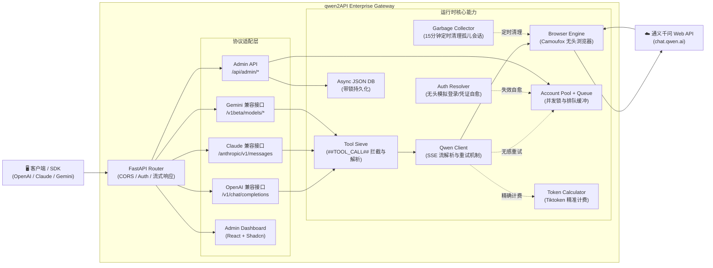

# qwen2API Enterprise Gateway

[](https://github.com/YuJunZhiXue/qwen2API/blob/main/LICENSE)
[](https://github.com/YuJunZhiXue/qwen2API/stargazers)
[](https://github.com/YuJunZhiXue/qwen2API/network/members)
[](https://github.com/YuJunZhiXue/qwen2API/releases)
[](https://hub.docker.com/r/yujunzhixue/qwen2api)

[](https://zeabur.com/templates/XXXXXX)
[](https://vercel.com/new/clone?repository-url=https%3A%2F%2Fgithub.com%2FYuJunZhiXue%2Fqwen2API)

语言 / Language: [中文](./README.md) | [English](./README.en.md)

将通义千问（chat.qwen.ai）网页版 Web 对话能力转换为 OpenAI、Claude 与 Gemini 兼容 API。后端为 **Python (FastAPI) 全量实现**，不依赖其他运行时；前端为基于 React + Shadcn 构建的管理台，提供极具现代感的暗黑系大盘交互。

---

## 架构概览

qwen2API 2.x（企业级模块化版）



- **后端**：Python (FastAPI + Uvicorn + Camoufox 无头引擎)
- **前端**：React + Vite + Shadcn UI 管理台（支持多图表仪表盘）
- **部署**：支持本地脚本启动、Docker 容器化部署、Zeabur 一键托管、Vercel 代理等多种方案

### 2.X 底层架构调整（相较 1.x 旧版本）

- **模块化解耦与重构**：将原有的单体单文件脚本拆解为 `core/`、`services/`、`api/` 等独立路由层，彻底根除代码冗余，显著提升系统的横向扩展能力与可维护性。
- **全协议原生适配**：打破仅兼容 OpenAI 的限制，现在原生提供对 Anthropic (`/anthropic/v1/messages`) 与 Gemini (`/v1beta/models/*`) 接口的深度转换，覆盖全球最主流的三大协议体系。
- **工具调用绝对控制 (Tool Sieve)**：针对千问网页版缺乏原生 Function Calling 的缺陷，植入底层的 Prompt 劫持与流式文本剥离（通过注入 `##TOOL_CALL##` 语法边界），在全协议下完美实现复杂的工具调用。同时加入 JSON 异常自愈网络，彻底解决大模型在工具输出时的字符转义与换行符报错。
- **无感容灾重拨与账号轮询**：当某个上游账号被限流（Rate Limit）或发生 Token 异常时，底层拦截器会挂起当前请求，并自动从并发池中抓取健康账号重试，全程对下游 SDK 调用方透明。
- **凭证自愈自动化引擎**：当遭遇 HTTP 401 或 403 权限问题时，`Auth Resolver` 自动在后台拉起隔离的浏览器沙盒模拟真实登录流程，无缝提取新 Token，实现真正的无人值守自愈。
- **并发防洪缓冲堤**：面对瞬时高并发请求，所有会话将自动进入等待队列，超过等待阈值优雅返回 `429 Too Many Requests`，强力保护核心浏览器引擎免于雪崩。
- **冷酷的精算师 (Token Calculator)**：深度内嵌 `tiktoken` 算法引擎，强制计算每个请求的 Prompt 与 Completion 的精准 Token 消耗，确保对下游租户的额度扣减绝对准确。
- **后台清道夫 (Garbage Collector)**：内建后台守护进程，按 15 分钟间隔自动巡检，无情焚烧所有因网络中断或异常产生的孤儿会话，防止上游账号记录出现不可控堆积。
- **深度运维探针闭环**：提供标准的 Kubernetes 级别存活与就绪探针（`/healthz`、`/readyz`），并附带底层故障请求的实时快照捕获。
- **Shadcn 纯后台面板**：前端整体重构，抛弃旧有框架，采用最新的 Shadcn 组件库打造极简暗黑风大盘，提供全局并发热力图、上游账号存活状态矩阵、下游 Token 令牌的动态签发与生命周期管理。

---

## 核心能力与接口支持

| 能力类型 | 接口/路径支持 | 详细说明 |
|---|---|---|
| **OpenAI 兼容** | `GET /v1/models`、`POST /v1/chat/completions`、`POST /v1/embeddings` | 完整支持 Stream 响应与函数调用；Embeddings 使用伪 Hash 模拟，完美骗过 OpenWebUI 等客户端检测。 |
| **Claude 兼容** | `POST /anthropic/v1/messages` | 原生兼容 Anthropic SDK，处理复杂的 Block 结构与系统级 Prompt。 |
| **Gemini 兼容** | `POST /v1beta/models/{model}:generateContent`、`...:streamGenerateContent` | 拦截 Google AI SDK 的专有协议体并平滑转换至底层。 |
| **多账号并发轮询** | - | 自动 Token 刷新，支持手机号/邮箱/临时验证码等多路径登录自愈，内建负载均衡器。 |
| **并发队列控制** | - | 为每个账号设定 In-flight 上限与排队槽位，防范封禁风险。 |
| **Tool Calling** | - | **防泄漏处理**：高置信特征识别、提前阻断模型输出工具调用的源码文本，强力约束大模型的 JSON 格式。 |
| **Admin API** | `/api/admin/*` | 提供动态配置更新、账号管理批量测试、清理上游会话、统计看板拉取等接口。 |
| **WebUI 管理台** | `/` (前端静态托管) | 一站式 React 单页应用，包含数据大盘、账号控制台、令牌签发中心。 |
| **运维探针** | `/healthz`、`/readyz` | 用于 Docker / K8s 的健康检测，确保服务状态随时可达。 |

---

## 平台与客户端兼容矩阵

| 兼容级别 | 平台 / 客户端 / SDK | 当前状态 | 备注 |
|---|---|---|---|
| **P0** | **OpenAI 官方 SDK** (Node.js / Python) | ✅ 完美兼容 | 涵盖 Chat 与 Stream。 |
| **P0** | **Anthropic 官方 SDK** | ✅ 完美兼容 | 支持多模态（文本）。 |
| **P0** | **Google Gemini SDK** | ✅ 完美兼容 | 支持 GenerateContent 流。 |
| **P0** | **Vercel AI SDK** | ✅ 完美兼容 | 原生适配 `openai-compatible`。 |
| **P0** | **Claude Code** (CLI) | ✅ 完美兼容 | 支持深度的系统文件读取与工具写入反馈环。 |
| **P1** | **OpenWebUI / NextChat** | ✅ 完美兼容 | 无缝接入，支持对话隔离。 |
| **P1** | **LangChain / LlamaIndex** | ✅ 完美兼容 | 针对复杂的 Agent 工具链表现优异。 |

---

## 智能模型路由

为了让不同的客户端都能获得最佳的生成效果，qwen2API 在内部实现了智能的模型名称映射路由，将外界五花八门的模型名，精确锚定到通义千问的最优模型：

| 客户端请求传入的模型名 (Alias) | 实际调用的底层目标模型 |
|---|---|
| `gpt-4o` / `gpt-4-turbo` / `o1` / `o3` | **`qwen3.6-plus`** |
| `gpt-4o-mini` / `gpt-3.5-turbo` / `o1-mini` | **`qwen3.5-flash`** |
| `claude-3-5-sonnet` / `claude-opus-4-6` | **`qwen3.6-plus`** |
| `claude-3-haiku` / `claude-3-5-haiku-latest` | **`qwen3.5-flash`** |
| `gemini-2.5-pro` / `gemini-1.5-pro` | **`qwen3.6-plus`** |
| `deepseek-chat` / `deepseek-reasoner` | **`qwen3.6-plus`** |

> **提示**：如果未命中上述映射表，系统默认将 fallback 回落到强大的 `qwen3.6-plus`。

---

## 快速开始

### 方式一：本地极速运行

**前置环境要求**：
- Python 3.10+
- Node.js 18.0+ / 20.0+ / 22.0+ (用于编译 WebUI)

```bash
# 1. 克隆仓库
git clone https://github.com/YuJunZhiXue/qwen2API.git
cd qwen2API

# 2. 安装后端核心依赖
cd backend
pip install -r requirements.txt
python -m camoufox fetch  # 极其重要：下载防风控无头浏览器内核

# 3. 安装并构建前端界面
cd ../frontend
npm install
npm run build  # 产物会自动放入后端约定的静态目录

# 4. 退回根目录，一键点火启动服务
cd ..
python start.py
```

启动后，系统将自动映射端口：
- **管理中枢 WebUI (Frontend)**：访问 `http://localhost:5173` (开发模式) 或通过主服务端口访问。
- **API 核心网关 (Backend)**：默认监听 `http://localhost:8080`。

### 方式二：Docker / Docker Compose (企业级推荐)

项目内附带了高度优化的多阶段构建 `Dockerfile`，彻底隔离了宿主机的环境污染。

```bash
# 1. 克隆仓库
git clone https://github.com/YuJunZhiXue/qwen2API.git
cd qwen2API

# 2. 启动服务编排
docker-compose up -d

# 3. 实时查看日志
docker-compose logs -f
```
启动完成后，默认会把宿主机的 `8080` 端口映射到容器内。你可以直接在前端通过 `http://localhost:8080` 访问管理大盘。更新镜像只需执行 `docker-compose up -d --build` 即可。

### 方式三：Zeabur 一键部署

1. 点击 README 顶部的 **Deploy on Zeabur** 徽章按钮，开启一键托管流程。
2. 部署完成后，访问生成的域名根路径即可进入管理台。
3. 默认情况下，你需要配置环境变量 `ADMIN_KEY` 作为后台登录口令。

### 方式四：Vercel 代理部署

1. 将仓库 Fork 到你的 GitHub。
2. 在 Vercel 工作台导入该仓库。
3. 配置必须的环境变量。由于 Vercel 为 Serverless 架构，无头浏览器无法在其内部长驻运行，所以此方案通常需要你另行准备外部的浏览器引擎节点（或者利用本项目的反向代理模式）。
4. 部署并绑定自定义域名。

---

## 全局配置与数据落盘

本系统所有的核心运行时状态均存储于 `data/` 目录下（该目录由程序在首次启动时自动创建，并建议在使用 Docker 时挂载为 Volume）：

- `data/accounts.json`：存放上游千问账号的矩阵信息、登录 Token 凭证以及账号限流状态。
- `data/users.json`：存放所有签发给下游客户端调用的 API Key，以及它们的 Token 额度、历史消耗统计等详细记录。
- `data/config.json` (可选)：系统的高级运行时配置覆盖。

**请务必妥善保管你的 `data/` 目录，它包含了所有的凭证与计费资产。**

---

## 许可证与免责声明

本项目采用 **MIT License** 许可开源。

**免责声明（重要）**：
本项目仅供个人学习与自动化技术研究使用，旨在探讨浏览器防风控自动化与 LLM API 协议转换的实现原理。
1. 本项目与相关官方服务（如阿里云、通义千问等）无任何利益关联，绝非官方提供的商业 API。
2. **严禁** 将本项目用于任何非法商业牟利、高并发灰黑产、或违反通义千问官方用户协议的生产环境中。
3. 因滥用本项目代码所导致的一切账号封禁、数据泄露、资产损失或法律纠纷，由使用者自行承担全部责任，本项目及核心开发者概不负责。
4. 若本项目的存在无意间侵犯了相关权利方的合法权益，请随时提交 Issue，我们将积极配合妥善处理或下线本项目。
